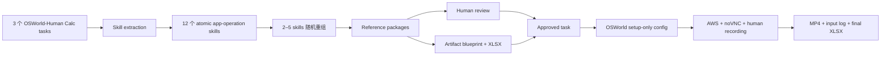
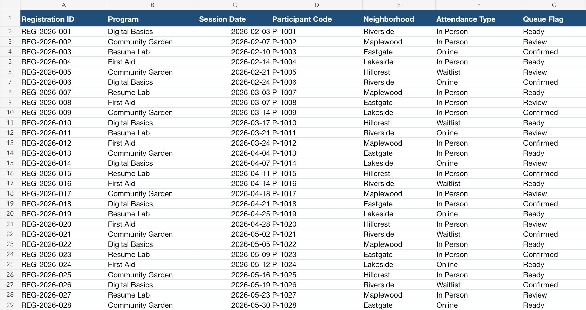

# Weekly Update：从 OSWorld-Human Skills 到可录制的 Reference Tasks

**汇报时长：约 30 分钟**  
**汇报日期：2026-08-05**  
**当前范围：LibreOffice Calc Pilot；benchmark construction，不涉及模型训练**

---

## 0:00–2:30｜这一周解决了什么问题

### 研究问题

现有 CUA agent 的 task success 在提高，但完成任务的操作效率仍明显低于人类。我们的核心问题是：

> Omni-model 能否从专家操作轨迹中归纳出高效、可迁移的操作技能，并帮助固定的 downstream agent 更准确、更高效地完成 OSWorld 任务？

这里的“学习”只发生在 inference time：

- 不做 SFT、RL 或微调；
- 不更新 omni-model 或 agent 参数；
- 专家 reference video 是 benchmark context，不是训练集；
- 后续比较同一个 agent 在 `without skill` 和 `with learned skill` 条件下的表现。

### 本周交付的不是几个静态任务，而是一条 construction pipeline



> **讲述重点：** 这一周的进展是把“从 golden actions 抽象技能”一直打通到“人类可以在真实 OSWorld 环境里开始标注视频”。

---

## 2:30–7:30｜第一步：从 OSWorld-Human 提取可迁移 Skills

### 数据选择

Pilot 固定选择 3 个技能类型差异较大的 `libreoffice_calc` 任务：

1. Formula、autofill、cross-sheet reference；
2. Formula-based conditional formatting 与 custom style；
3. Pivot Table field placement 与 aggregation。

三个 source tasks 一共包含 40 条 OSWorld-Human `single-action`。

### LLM 输入边界

Skill extraction 时，LLM 只接收：

```json
{
  "instruction": "Original OSWorld task instruction",
  "single_steps": [
    "[0] CLICK ...",
    "[1] TYPE ..."
  ]
}
```

LLM 不接收 task ID、evaluator、artifact 或 grouped actions。可信的 app、task ID 和 action provenance 在返回后由本地代码注入。

### Skill schema

每个 skill 最终只保留构建 benchmark 所需的信息：

```json
{
  "app": "libreoffice_calc",
  "name": "Set a Pivot Table value aggregation to Count",
  "procedure": [
    "Double-click the field shown in the Data Fields area.",
    "Choose Count instead of Sum.",
    "Confirm the field settings and Pivot Table layout."
  ],
  "efficiency_tip": "Set the aggregation immediately after placing the field.",
  "source": {
    "task_id": "1954cced-...",
    "action_ids": [7, 8, 9, 10]
  }
}
```

### 为什么这个粒度合适

Skill 必须：

- 小于一个完整任务，避免把 golden solution 整体泄露给 agent；
- 大于单个 click/type，能够表达可复用的应用操作技巧；
- procedure 足够具体，并包含 UI 行为或公式例子；
- 只描述 app operation，不把业务目标当作 skill。

例如：

- 好的 skill：`Fill a formula down using the fill handle`；
- 不应成为 skill：`Calculate gross profit`；
- 过细的条目：`Click OK`。

### 结果

- 40 个 source actions；
- 38 个 substantive actions 被归入 skill；
- 2 个普通 header 输入动作保留为 scaffolding；
- 得到 12 个 atomic skills；
- action assignment 没有重复归属。

> **讲述重点：** 我们保留的是“可以在另一份表格、另一个任务里复用的 Calc 操作方式”，而不是原任务答案。

---

## 7:30–13:30｜第二步：把 Skills 重组成新的 Reference Tasks

### 为什么不能直接录原任务

如果 reference video 与 target task 完全 1:1，模型只需复现 golden solution，无法证明它学会了可迁移技能。

因此 reference generation 使用以下约束：

- 每次只采样同一 app 的 2–5 个 skills；
- 新任务必须使用不同 domain、对象、数值和 artifact；
- 不能复现某个 source task 的完整 ordered solution；
- 少量 task-specific 或 prerequisite 操作可以存在，但必须显式声明；
- skills 无法自然组合时，LLM 可以拒绝生成。

### 贯穿示例：`reference-task-r01-001`

该任务组合了三个 skills：

1. Pivot Table value aggregation 设置为 `Count`；
2. 创建 formula-based conditional formatting rule；
3. 创建带背景色的 custom cell style。

生成的 task instruction：

> In the Workshop Enrollment Queue, create a new “Program Registration Counts” summary that shows how many enrollment records each Program has, using Participant Code as the registration measure. Also make Review entries in the Enrollment Log’s Queue Flag column stand out with a formula-driven custom pale-amber background (#FCE4D6), while leaving Ready and Confirmed entries unhighlighted.

它不再使用 source tasks 的内容，而是转成 community workshop enrollment 场景。三个操作仍然是完成任务所必需的，但没有直接复制任意 source task。

### Reference package 不只有 task instruction

每个 package 包含三部分：

1. **Task**：结果导向 instruction 与 required skill IDs；
2. **Artifact spec**：需要怎样的初始 XLSX、哪些结果不能预先完成；
3. **Operator guide**：给人类专家参考的 operation intent、efficiency tip 和 visible success signal。

另外记录 `expected_incidental_operations`，例如“先选择 Queue Flag 范围”是必要 scaffolding，但不计入 skill coverage。

### Similarity 只做 audit，不做自动裁决

对每个 candidate 同时计算：

- lexical sequence similarity；
- `text-embedding-3-small` cosine similarity；
- sampled skills 分别来自哪些 source tasks。

示例任务的最高分：

| Audit | Value |
| --- | ---: |
| Max lexical similarity | 0.204633 |
| Max semantic cosine similarity | 0.319971 |
| Dominant source skill fraction | 0.666667 |

这些数值只帮助 reviewer 定位风险。两个任务都涉及 Pivot Table 时 semantic similarity 偏高是正常的；真正需要拒绝的是完整 solution 或 distinctive content 的实质性复现。

### 当前候选结果

| Reference task | Skills | 简要目标 |
| --- | ---: | --- |
| `r01-001` | 3 | Count Pivot + formula conditional formatting + custom style |
| `r01-002` | 2 | Net Allocation formula + Service Area Pivot summary |
| `r01-003` | 5 | Route tags + new sheet + carrier-count Pivot dashboard |
| `r01-004` | 2 | Billed Charge formula/currency + coordinator Pivot summary |

4 个 candidate packages 在候选层面覆盖全部 12 个 skills。

> **讲述重点：** Candidate coverage 不等于 benchmark coverage；只有 human-approved package 才计入正式 coverage。

---

## 13:30–18:00｜第三步：从 Artifact Spec 生成真实 XLSX

### 两阶段生成，而不是让 LLM 直接写二进制文件

```text
Reference package
→ LLM 生成 strict Calc artifact blueprint
→ JSON Schema + 本地语义校验
→ deterministic Node builder
→ initial_artifact.xlsx + preview PNG + QA + SHA256
```

LLM 负责内容设计，例如：

- sheet 名称、columns 和 data types；
- 每一行合成数据；
- 初始 number format；
- 允许预置的公式；
- 哪些结果必须保持空白。

确定性 builder 负责真正的 XLSX、样式、AutoFilter、渲染和错误扫描。这样 frozen blueprint 可以在不重复调用 LLM 的情况下重建。

### 示例 artifact



这个 workbook 在录制前满足：

- `Enrollment Log` 有 28 行 synthetic records；
- Program 的总数设计为 8、7、6、7；
- 恰好 8 个 `Review` entries；
- 没有 Pivot Table；
- 没有 conditional formatting；
- 没有预建 pale-amber style。

因此视频会真正展示目标 skills，而不是展示一个已经完成的 artifact。

### Artifact QA

每个 artifact 都记录：

- workbook SHA256；
- blueprint path；
- preview path；
- formula-error scan；
- 是否需要 manual setup。

当前四个 XLSX 都是 synthetic data，且 `manual_setup_required=false`。

> **讲述重点：** Artifact 不只是输入文件，它定义了“哪些操作必须发生在视频里”。

---

## 18:00–22:00｜第四步：Human Reviewer 是正式 Coverage 的 Gate

### 为什么必须有人审

LLM 与相似度分数无法可靠判断：

- skill 是否真的必要；
- task 是否自然；
- operator guide 是否过度接近 golden trajectory；
- artifact 是否提前完成了应录制的操作；
- 与 source task 是否只是换词而没有换任务结构。

### Reviewer 看到什么

- reference package；
- sampled skills 与 source provenance；
- lexical/semantic similarity；
- artifact spec、真实 XLSX 与 preview；
- operator guide 与 incidental operations。

### 三种 decision

| Decision | 含义 | 后续行为 |
| --- | --- | --- |
| `approved` | 可以进入正式 annotation | Skills 计入 approved coverage |
| `revision_requested` | Skill 组合合理，但 package 需要修订 | 保持相同 skill set，携带 reviewer feedback 重生成 |
| `rejected` | 组合本身不自然、不可行或严重泄漏 | 屏蔽 exact combination，将 skills 放回 pool |

Review JSON 示例：

```json
{
  "reference_task_id": "reference-task-r01-001",
  "decision": "approved",
  "reason_codes": [],
  "revision_instructions": [],
  "reviewer": "reviewer-jz",
  "notes": "The task is natural, feasible, and sufficiently different from the sources."
}
```

### 当前状态

- Candidate coverage：12/12；
- Approved coverage：0/12；
- 原因：4 个 packages 当前都保持 `pending`；
- 正式 runner 默认拒绝 pending task；
- `--allow-pending` 只用于工程 smoke，不会绕过 revision/rejected。

> **讲述重点：** Human reviewer 不是最后补签字，而是 benchmark construction 中明确的可信边界。

---

## 22:00–27:00｜第五步：一键启动 OSWorld Human Annotation

### 从 blueprint 到安全的 OSWorld config

针对每个 approved package，另一次受约束的 LLM call 只生成 setup blueprint，例如：

```json
{
  "snapshot": "libreoffice_calc",
  "artifact_slot": "initial_artifact",
  "guest_filename": "workshop_enrollment.xlsx",
  "open_after_upload": true,
  "ready_state_checks": [
    "LibreOffice Calc is open with Enrollment Log active.",
    "No pivot output or conditional formatting is present."
  ]
}
```

LLM 不接触可信 host path、SHA256 或任意 shell command。本地 assembler 校验 artifact hash 后，只注入两个标准 actions：

```json
"config": [
  {
    "type": "upload_file",
    "parameters": {
      "files": [{
        "local_path": ".../initial_artifact.xlsx",
        "path": "/home/user/Desktop/workshop_enrollment.xlsx"
      }]
    }
  },
  {
    "type": "open",
    "parameters": {
      "path": "/home/user/Desktop/workshop_enrollment.xlsx"
    }
  }
]
```

Reference task config 明确没有 evaluator。它的职责是复现标注起点，而不是自动判断任务完成质量。

### 一键启动命令

正式 annotation：

```bash
python scripts/python/record_reference_task.py \
  --reference-task-id reference-task-r01-001
```

本次会议 smoke 使用：

```bash
python scripts/python/record_reference_task.py \
  --reference-task-id reference-task-r01-001 \
  --allow-pending
```

### 人类标注交互

```text
AWS preflight
→ 当前公网 IP /32 security group
→ 官方干净 Ubuntu AMI
→ upload + open XLSX
→ 终端显示 task/guide/noVNC
→ 第一次 Enter：开始 MP4 + xinput + screenshots
→ Expert 操作
→ 第二次 Enter：停止录制
→ Ctrl+S + 下载 final XLSX
→ 写 annotation bundle
→ finally terminate EC2；TTL 兜底
```

Operator guide 只显示在本地终端，不进入 noVNC，因此不会污染 reference video。

### Annotation bundle

```text
recording.mp4
input_events.xinput.log
frames/
events.jsonl
episode_manifest.json
initial_artifact.xlsx
final_artifact.xlsx
reference_task_config.json
reference_package.json
reference_review.json
artifact_manifest_entry.json
```

第二位 annotator 在本地观看 MP4、检查 final XLSX，不需要在 AWS 实例里播放视频。

### Live demo 建议（约 2 分钟）

1. 展示终端里的 task instruction、guide 和 `Press Enter to START recording`；
2. 打开隔离、直连的 Chrome noVNC；
3. 展示已经自动打开的 Enrollment Log；
4. 强调此时还没有开始录制，环境准备过程不会进入视频；
5. 如果不准备现场完成整个 Calc task，不要按第一次 Enter。

> **当前真实验证边界：** AWS 实例创建、noVNC、artifact upload/open、终端 guide 和录制前等待已经验证；完整的 Enter-start → Enter-stop → final XLSX bundle 仍待完成本次 smoke。

---

## 27:00–30:00｜结果、成本、风险与下一步

### 当前阶段结果

| Stage | Frozen output | Calls | Tokens in/out | Accepted-run cost |
| --- | --- | ---: | ---: | ---: |
| Skill extraction | 12 skills | 3 | 3690 / 2249 | `$0.034368` |
| Reference packages | 4 packages | 4 | 6400 / 8485 | `$0.114620` |
| Semantic audit | cosine scores | 1 batch | 337 / — | `$0.00000674` |
| Artifact generation | 4 XLSX | 4 | 9167 / 3447 | `$0.059698` |
| Annotation config | 4 configs | 4 | 6712 / 678 | `$0.021560` |
| **合计** | 当前 accepted outputs | — | — | **约 `$0.230253`** |

上述合计不包含 prompt 开发迭代和早期废弃输出，只反映当前 frozen artifacts 对应的 accepted runs。

### 本周工程上解决的关键问题

1. **Schema compliance**：使用 Structured Outputs，再做本地 provenance/ID/action semantic validation；
2. **Non-1:1 construction**：从 skill pool 组合新任务，而不是重放 source solution；
3. **Reproducibility**：prompt hash、model、tokens、cost、artifact SHA256 全部可审计；
4. **Human trust boundary**：approved coverage 与 candidate coverage 分离；
5. **Setup-only OSWorld**：reference task 不需要 evaluator，也不引入完整 OSWorld agent dependency；
6. **Cloud safety**：SSO、官方 AMI、当前 IP `/32`、自动 terminate、180 分钟 TTL；
7. **Local proxy robustness**：noVNC WebSocket 被代理拦截时，用隔离的 direct Chrome profile，不放宽 AWS security group。

### 仍未完成

- 4 个 packages 的正式 human review；
- 完整录制 smoke 和结果包 QA；
- 第二位 annotator 的 video cross-validation；
- 将 reference videos 拆分、重组成非 1:1 video bank；
- omni-model skill induction 与 downstream agent paired evaluation。

### 下一步

1. Review 四个 packages，处理 revision/rejection；
2. 对 approved tasks 完成专家录制；
3. 本地 cross-validate MP4、skill coverage 和 final XLSX；
4. 冻结 reference video fragments 和 provenance；
5. 再进入 omni-model / omni-agent 的 inference-only benchmark 实验。

### 一句话总结

> 本周已经把 OSWorld-Human 的 golden single actions 转化成了可审核、可重组、可复现，并能在真实 AWS OSWorld 环境中一键启动的人类 reference-video 标注任务；下一阶段的重点不再是生成更多 JSON，而是完成 human approval、真实录制和 cross-validation。

---

## 备用页｜可能被问到的问题

### Q1：为什么不直接使用 OSWorld-Human 的完整轨迹？

OSWorld-Human 公开的是 `single-action` / `grouped-action` 操作标注，不是带视频、坐标、时间戳和 observation 的真实 GUI episode。我们仍需人工 replay 和录制。

### Q2：为什么 reference task 没有 evaluator？

它的目标是录制清晰的技能演示，不是产生正式 benchmark score。正确性由 human cross-validation 检查；final XLSX 作为辅助证据保存。

### Q3：为什么需要 artifact generation？

相同 skill 必须出现在不同内容和对象上，才能测试 transfer。新 artifact 也是避免 source-task leakage 的关键部分。

### Q4：Operator guide 会不会变成 golden solution？

Guide 描述 operation intent、efficiency tip 和 visible success signal，但允许顺序变化和等价操作。后续给模型的是拆分重组的视频，不是 guide 或完整 ordered trajectory。

### Q5：当前最主要的研究风险是什么？

Reference task 可能仍然太接近 source solution，或者视频里 incidental operations 太多。解决方式是 human review、similarity audit、skill coverage 检查，以及后续 fragment-level leakage report。

### Q6：这个 Pilot 的成功标准是什么？

- 12 个 skills 都至少出现在一个 approved reference task；
- 每个 approved task 有可复现的 initial artifact 和 config；
- 两位 annotator 能完成录制与本地交叉验证；
- 每次 LLM call、artifact 和 video 都有可审计 provenance；
- 后续能用这些 videos 构造非 1:1 reference context。
